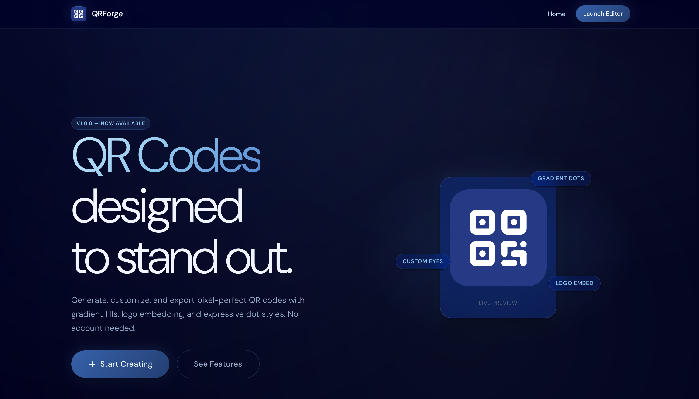
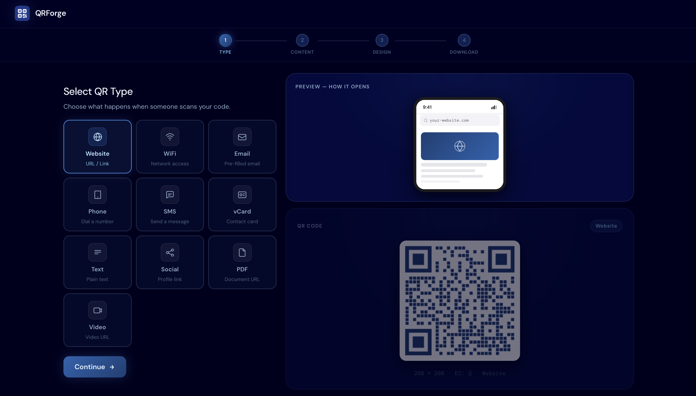

<h1 align="center">
  
   
  QRForge
</h1>

  Fast, customizable QR code generator for modern, premium interfaces.

  <a href="https://qrforgeapp.netlify.app/">qrforgeapp.netlify.app</a>

---

## What is QRForge?

**QRForge helps you create unique, visually striking QR codes for any purpose:**

- Websites  
- Business cards / vCards  
- Menus  
- Social media links  
- PDFs, videos, and other digital content  
- Marketing campaigns  
- Personal projects  

**`No sign-up. No cost. Just QR codes.`**

---

## How It Works

Generating your perfect QR code is fast and intuitive:

1. **Select your QR type** – website, social media, vCard, menu, PDF, or custom content.  
2. **Add content** – provide URLs, files, or text to encode.  
3. **Customize your QR code** – choose shapes (square, rounded, heart, star), colors, gradients, eye styles, logos, and additional text overlays.  
4. **Preview your design** – see the final QR as it will appear to users.  
5. **Export instantly** – download as **SVG**, **PNG**, **JPG**, or **PDF**, ready for web or print.

> [!TIP]
> Mix shapes, gradients, and embedded logos to create a QR code that matches your brand perfectly.

---

## Example

  

  

---

<h3 align="center">
QRForge does not accept QR code templates via pull requests. Feature requests and design suggestions are welcome through GitHub issues.
</h3>

---

  © 2026 Niko Marinović. All rights reserved.

